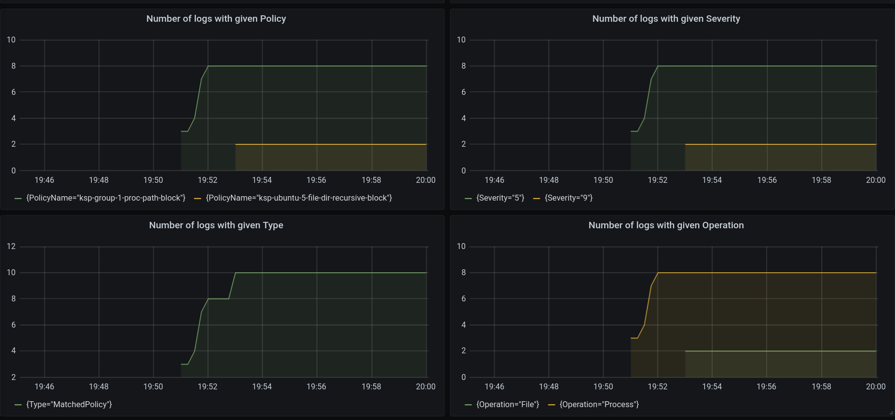

# Prometheus-Exporter for KubeArmor  

## Installation

Clone the repository and _cd_ into Prometheus-Exporter  
To run the Prometheus exporter (kubearmor-prometheus-client), we need Kubearmor to be already deployed. After that run:

```
kubectl apply -f client_deploy.yaml
```
This will deploy our Kubearmor Prometheus Client.  
Now we will need to run the Prometheus and Grafana deployment.   
The prometheus_grafana.yaml is highly inspired from the Cilium's example deployment of Prometheus and Grafana [https://raw.githubusercontent.com/cilium/cilium/1.10.2/examples/kubernetes/addons/prometheus/monitoring-example.yaml](https://raw.githubusercontent.com/cilium/cilium/1.10.2/examples/kubernetes/addons/prometheus/monitoring-example.yaml).

```
kubectl apply -f prometheus_grafana.yaml
```

This is an example deployment that includes Prometheus and Grafana in a single deployment.

The default installation contains:  
* **Grafana:** A visualization dashboard with Cilium Dashboard pre-loaded.  
* **Prometheus:** a time series database and monitoring system.  

We will apply some policies on our sample deployment to generate metrics.
Create multiubuntu microservice and apply sample policies to generate logs. To do so please refer [https://github.com/accuknox/KubeArmor/blob/master/examples/multiubuntu.md](https://github.com/accuknox/KubeArmor/blob/master/examples/multiubuntu.md)

Now we can check the logs generated by:
```
kubectl logs <podname> -n <namespace>
```
The podname will start with _kubearmor-prometheus-client_ and namespace will be _kube-system_.

### To access Grafana

Expose the port on your local machine
```
kubectl -n explorer port-forward service/grafana --address 0.0.0.0 --address :: 3000:3000
```

### To access Prometheus

Expose the port on your local machine
```
kubectl -n explorer port-forward service/prometheus --address 0.0.0.0 --address :: 9091:9090
```

---
**Note:** If you are running it inside a vagrant you will need to port-forward the vagrant while ssh (ing) into it using:
```
vagrant ssh -- -L 9090:127.0.0.1:9091
```
for prometheus and

```
vagrant ssh -- -L 3000:127.0.0.1:3000    
```
for grafana.

---

You should be able to see the below mentioned metrics on Prometheus UI at [localhost:9090](127.0.0.1:9090).  
To view the Grafana Dashboard, head over to [localhost:3000](127.0.0.1:3000). You should be able to view the KubeArmor Dashboard.  

## Metrics
It exposes the following KubeArmor metrics to Prometheus:  

|                               About Metrics                                |     Label     |              Metric name                 |
| -------------------------------------------------------------------------- | :-----------: | ---------------------------------------: |
| Number of logs generated on Host                                           |HostName       |kubearmor_relay_logs_in_host_total        |
| Number of logs generated on Namespace                                      |NamespaceName  |kubearmor_relay_logs_in_namespace_total   |
| Number of logs generated on Pod                                            |PodName        |kubearmor_relay_logs_in_pod_total         |
| Number of logs generated on Container                                      |ContainerName  |kubearmor_relay_logs_in_container_total   |
| Number of logs generated on Policy                                         |PolicyName     |kubearmor_relay_policy_logs_total         |
| Number of logs with severity                                               |Severity       |kubearmor_relay_logs_with_severity_total  |
| Number of logs with type (MatchedPolicy, SystemLog)                        |Type           |kubearmor_relay_logs_with_type_total      |
| Number of logs with operation (Process, File, Network, Capabilities)       |Operation      |kubearmor_relay_logs_with_operation_total |
| Number of logs with action (Allow, Audit, Block)                           |Action         |kubearmor_relay_logs_with_action_total    |

## Grafana Dashboard





