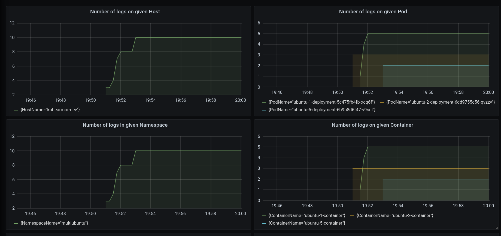
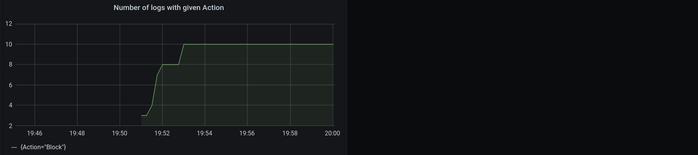

# Prometheus Exporter for KubeArmor

Prometheus Exporter calculates various metrics based on alerts generated by KubeArmor and provides the metrics to Prometheus.

## Exporter Deployment

Here, you can simply deploy the Prometheus exporter.

```
$ cd kubearmor-prometheus-exporter/deployments
~/kubearmor-prometheus-exporter/deployments$ kubectl apply -n [target namespace] -f exporter-deployment.yaml
```

### Prometheus Deployment (with Grafana)

If you do not have a Prometheus setup, you can quickly set up the Prometheus with Grafana.

```
$ cd kubearmor-prometheus-exporter/deployments/prometheus
.../deployments/prometheus$ kubectl create namespace kubearmor
.../deployments/prometheus$ kubectl apply -f prometheus-grafana-deployment.yaml
```

The prometheus-grafana-deployment.yaml is highly inspired from the Cilium's example deployment of Prometheus and Grafana ([https://.../cilium/cilium/.../examples/kubernetes/.../prometheus/monitoring-example.yaml](https://raw.githubusercontent.com/cilium/cilium/1.10.2/examples/kubernetes/addons/prometheus/monitoring-example.yaml)).

* **Grafana:** A visualization dashboard with Cilium Dashboard pre-loaded.  
* **Prometheus:** a time series database and monitoring system.  

### Prometheus Access

Expose the port on your local machine
```
kubectl -n kubearmor port-forward service/prometheus --address 0.0.0.0 --address :: 9091:9090
```

### Grafana Access

Expose the port on your local machine
```
kubectl -n kubearmor port-forward service/grafana --address 0.0.0.0 --address :: 3000:3000
```

---
**Note:** In vagrant, you will need to configure port-forwarding to access the Prometheus and Grafana services.

For Prometheus
```
vagrant ssh -- -L 9090:127.0.0.1:9091
```
You should be able to see the following metrics on Prometheus UI at [localhost:9090](127.0.0.1:9090).  

For Grafana
```
vagrant ssh -- -L 3000:127.0.0.1:3000    
```
To view the Grafana Dashboard, head over to [localhost:3000](127.0.0.1:3000). You should be able to view the KubeArmor Dashboard.  

---

## Metrics

|                                   About Metrics                                   |     Label     |              Metric Name             |
| --------------------------------------------------------------------------------- | :-----------: | ------------------------------------ |
| Number of alerts per Host                                                         |HostName       |kubearmor_alerts_in_host_total        |
| Number of alerts per Namespace                                                    |NamespaceName  |kubearmor_alerts_in_namespace_total   |
| Number of alerts per Pod                                                          |PodName        |kubearmor_alerts_in_pod_total         |
| Number of alerts per Container                                                    |ContainerName  |kubearmor_alerts_in_container_total   |
| Number of alerts per Policy                                                       |PolicyName     |kubearmor_alerts_with_policy_total    |
| Number of alerts per severity                                                     |Severity       |kubearmor_alerts_with_severity_total  |
| Number of alerts per type (MatchedPolicy, MatchedHostPolicy, MatchedNativePolicy) |Type           |kubearmor_alerts_with_type_total      |
| Number of alerts per operation (Process, File, Network, Capabilities)             |Operation      |kubearmor_alerts_with_operation_total |
| Number of alerts per action (Allow, Audit, Block)                                 |Action         |kubearmor_alerts_with_action_total    |

## Grafana Dashboard





